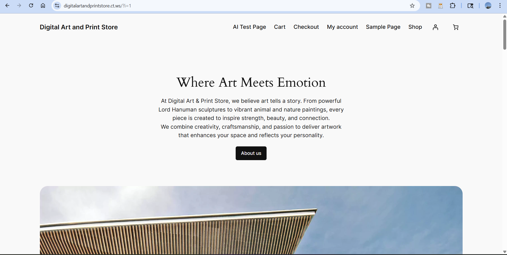
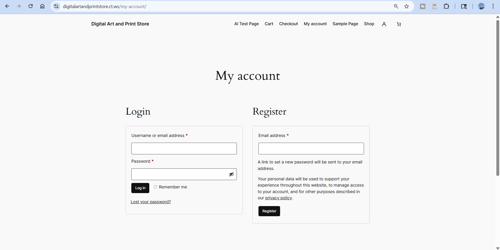
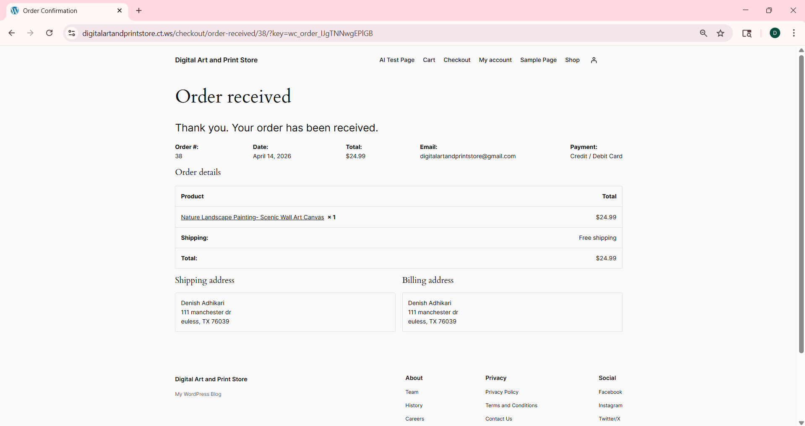

# secure-ecommerce-website
Secure e-commerce web application built with WordPress and WooCommerce, featuring user authentication, payment integration, and security enhancements including firewall and 2FA.
## Objectives
- Build a functional e-commerce platform
- Implement user authentication
- Integrate payment system
- Apply basic security practices

## Technologies Used
- WordPress (CMS)
- WooCommerce (E-commerce functionality)
- InfinityFree Hosting

## Security Features
- User registration and authentication system
- Firewall and malware protection using Wordfence
- Two-Factor Authentication (2FA) for secure login
- Secure payment integration using Stripe
- Spam protection and form security

## Screenshots

### Homepage

### Login / Registration

### Payment Page

## What I Learned
- How to configure and deploy a web application
- Basics of web security and protection tools
- Managing authentication and payment systems

## Future Improvements
- Implement advanced security configurations
