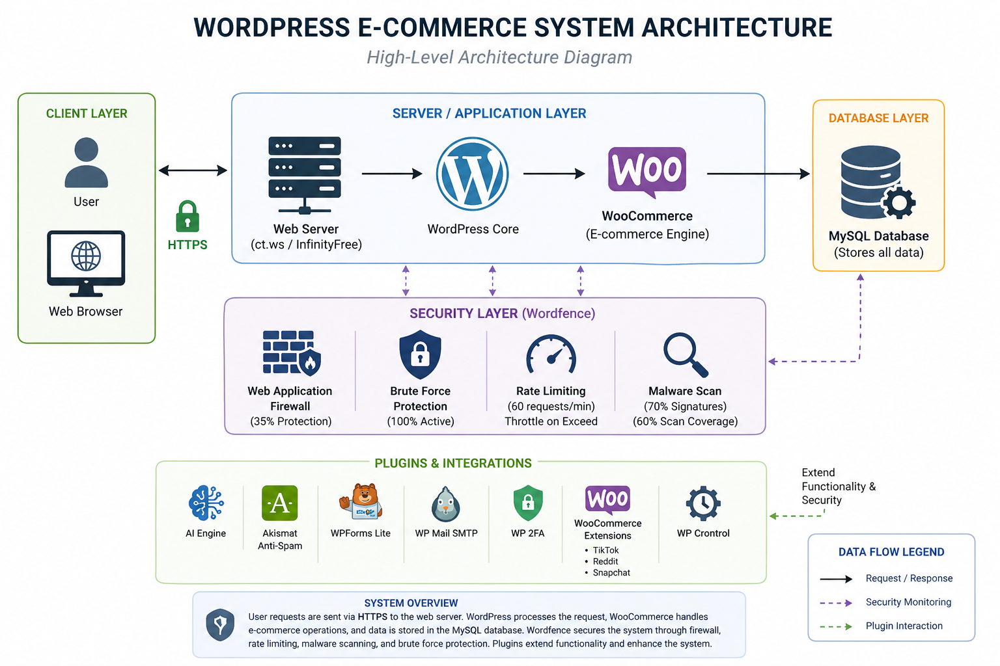
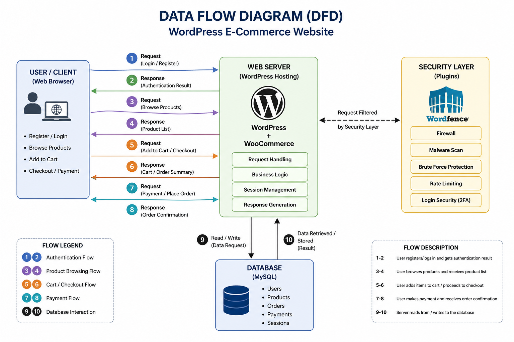
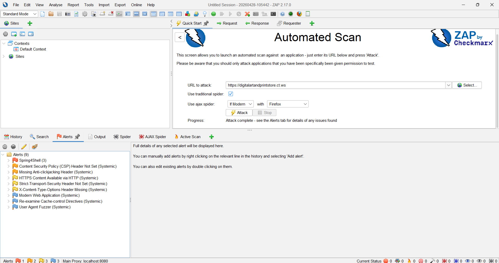
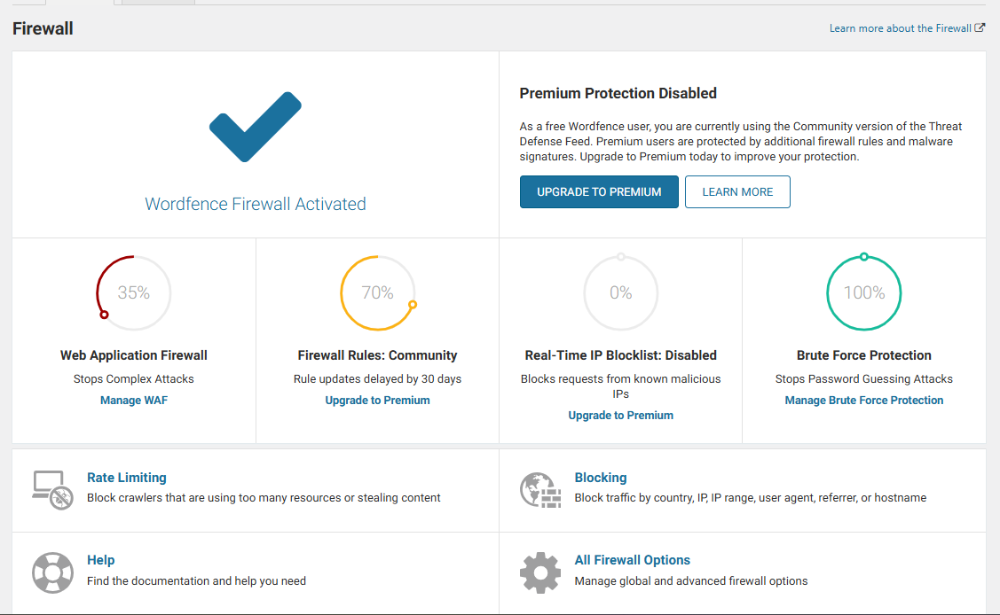

# Secure-ecommerce-website
Secure e-commerce web application built with WordPress and WooCommerce, featuring user authentication, payment integration, and security enhancements including firewall and 2FA.
## Live Demo
The project is hosted on InfinityFree.
URL: https://digitalartandprintstore.ct.ws

## Analyst Information
**Name:** Denish Adhikari  
**Role:** Security Analyst (Lab Project)  
**Environment:** WordPress + WooCommerce  
**Hosting:** InfinityFree (Free Hosting Environment)  
**Security Tools:** OWASP ZAP, Wordfence  

---

## Executive Summary

This project presents a security assessment of a live WordPress-based e-commerce application. The objective was to evaluate the application’s security posture using automated vulnerability scanning and internal security controls.

The assessment identified multiple medium-severity security misconfigurations, primarily related to missing HTTP security headers and incomplete HTTPS enforcement.

No critical exploitable vulnerabilities were confirmed. However, the identified issues increase the overall attack surface and may expose the application to common web-based attacks such as Cross-Site Scripting (XSS), Clickjacking, and Man-in-the-Middle (MITM) attacks.

**Overall Risk Rating:** Medium  

---

## Scope of Assessment

**Application Type:** E-commerce Web Application  
**CMS:** WordPress  
**E-commerce Plugin:** WooCommerce  
**Database:** MySQL  
**Hosting Environment:** InfinityFree (Free Hosting)

**Security Tools Used:**
- OWASP ZAP (External Vulnerability Scanning)
- Wordfence (Web Application Firewall & Security Monitoring)

---

## System Architecture

The application follows a standard 4-tier architecture:

- Client Layer: User Browser  
- Web Server Layer: WordPress Hosting Environment  
- Application Layer: WordPress + WooCommerce  
- Database Layer: MySQL  
- Security Layer: Wordfence Firewall + Security Plugins  

### System Architecture Screenshot

---

## Data Flow Analysis

User requests are processed through the following flow:

User → Browser → Web Server → WordPress Application → MySQL Database → Response

Security inspection revealed that insufficient header-level protections exist at the application layer, increasing exposure to client-side attacks.

### Data Flow Diagram Screenshot

---

## Vulnerability Assessment Summary

The system was scanned using OWASP ZAP, producing the following results:

- Total Alerts: 9  
- High Severity: 3 (False Positives)  
- Medium Severity: 6 (Security Misconfigurations)  

---

## Key Findings

### 1. Spring4Shell Detection (False Positive)
**Severity:** High  
**Status:** Not Applicable  

**Analysis:**  
The detected vulnerability applies to Java Spring Framework applications. The target system is built on WordPress (PHP-based architecture), making this finding irrelevant.

---

### 2. Missing Content Security Policy (CSP)
**Severity:** Medium  
**Risk:** Cross-Site Scripting (XSS)

**Impact:**  
The absence of CSP allows unrestricted execution of scripts, increasing the risk of client-side injection attacks.

---

### 3. Missing X-Frame-Options Header
**Severity:** Medium  
**Risk:** Clickjacking

**Impact:**  
The application can be embedded within malicious iframes, enabling UI redressing attacks.

---

### 4. Missing HTTP Strict Transport Security (HSTS)
**Severity:** Medium  
**Risk:** Man-in-the-Middle (MITM)

**Impact:**  
Users may be downgraded from HTTPS to HTTP, exposing sensitive data to interception.

---

### 5. Missing X-Content-Type-Options Header
**Severity:** Medium  
**Risk:** MIME Sniffing

**Impact:**  
The browser may misinterpret file types, potentially executing malicious content.

---

### 6. Incomplete HTTPS Enforcement
**Severity:** Medium  
**Risk:** Data Exposure

**Impact:**  
Initial HTTP requests may be intercepted before redirection to HTTPS.

---

### Detailed Vulnerability Evidence

---

## Security Controls Analysis

### Wordfence Security Implementation

The application uses Wordfence as a primary defensive control layer.

**Implemented Protections:**
- Brute-force attack protection (100% effective)
- Two-Factor Authentication (2FA)
- Malware scanning capability
- Web Application Firewall (WAF)

### Wordfence Dashboard Screenshot

---

## Attack Path Scenario (Real-World Simulation)

An attacker could potentially exploit the system using the following sequence:

1. Perform reconnaissance using automated scanning tools  
2. Identify missing security headers  
3. Exploit XSS vulnerabilities due to lack of CSP  
4. Perform clickjacking attacks via iframe injection  
5. Intercept traffic due to missing HSTS enforcement  
6. Attempt brute-force login attacks (mitigated by Wordfence)  

---

## Risk Assessment

The system does not contain any confirmed critical vulnerabilities. However, multiple configuration weaknesses increase the likelihood of exploitation when combined.

**Final Risk Rating:** Medium  

---

## Screenshots

### Homepage

### Login / Registration

### Payment Page

---

## Recommendations

### Immediate Actions
- Implement Content Security Policy (CSP)
- Enable HTTP Strict Transport Security (HSTS)
- Add X-Frame-Options header
- Add X-Content-Type-Options header

---

### Short-Term Improvements
- Enforce HTTPS across all endpoints
- Update all plugins and themes
- Optimize Wordfence firewall configuration
- Remove unnecessary exposed services

---

### Long-Term Security Enhancements
- Migrate to secure paid hosting environment
- Conduct periodic vulnerability assessments
- Implement centralized logging and monitoring
- Apply WordPress hardening best practices (CIS benchmarks)

---

## Root Cause Analysis

The identified vulnerabilities are primarily caused by:

- Default or incomplete security configurations  
- Missing HTTP security headers  
- Limitations of free hosting infrastructure  
- Lack of advanced hardening controls  

---

## Conclusion

This assessment demonstrates a real-world web application security evaluation of a WordPress-based e-commerce system.

While no critical vulnerabilities were identified, multiple misconfigurations highlight the importance of secure deployment practices and continuous security monitoring.

This project demonstrates practical cybersecurity skills in:

- Web application vulnerability assessment  
- Security misconfiguration analysis  
- Risk evaluation and prioritization  
- Defensive security implementation  
- Attack path analysis  

---

## Author

**Denish Adhikari**  
Cybersecurity Student | Aspiring SOC Analyst
